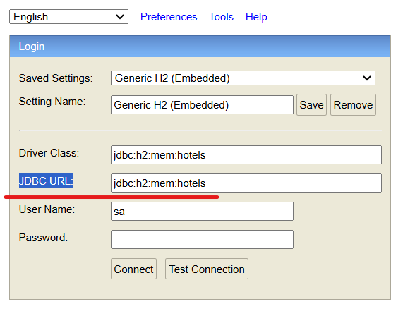

## Sobre o app

### O que é e para que serve
Esta é a API mais básica do sistema de gestão hoteleira, desenvolvido por Rolmer Telis de Oliveira, com filnalidade de ensino de vários tópicos de programação java com spring

### Como esta API está contextualizada
O objetivo é que esta API seja parte de um conjunto de APIs, cada uma com sua responsabilidade, dentro de um contexto comum, que é um sistema fictício de gestão hoteleira, desenvolvido por uma fictícia software house

### Exsite algum padrão compartilhado ou obedecido pelas partes do contexto?
Não existe. Cada API desse sistma fictíco pode conter um estilo de codificação totalmente divergente do restante. Se não fosse dessa forma, não serviria para estudo. Pode haver erros, propositadamente provocados, para prova de conceito, em algumas das branches. Se alguma branch puder ser minimamente confiável, será a main. Esteja atento a isso

### Como rodar esta API e realizar testes
1 - Sempre use os application-***.yml, para definir comportamneto para cada ambiente
2 - Defina no application principal, qual ambiente está sendo considetado para rodar a apliação

Veja o exemplo abaixo, de como definir o ambiente, no application.yml

```yaml
spring:
  profiles:
    active: local
```

```yaml
spring:
  profiles:
    active: dev
```
3 - Mantenha quantos aquivos application***.yml forem necessários para seus experimentos e testes

4 - Esteja atento à porta onde a API estará rodando, pode ser que você, para algum teste de integração, estaja rodando mais de uma API, simultaneamente. Configura e porta no application***.yml, considerado nos seus testes. Veja exemplos:

**no arquivo application-dev.yml**
```yaml
server:
  port: 8080
```

**no arquivo application-local.yml**
```yaml
server:
  port: 8081
```

### Sobre o banco de dados h2 em memória
As configurações necessárias para rodar o SGBD h2 em memória, estão no file application.yml, mas fique atento ao seguinte:
A url para acesso ao console do h2 é relativa ao caminho da sua API, portanto pode variar, de acordo com a porta que foi definida para rodar a aplicação

Na porta 8080:
```shell
  http://localhost:8080/h2/
```

Mudando para a porta 8081:
```shell
http://localhost:8081/h2/
```
Quando aparecer a caixa de diálogo para logar, lembre-se de preencher o campo JDBC URL com as informações relativas ao seu banco de dados




